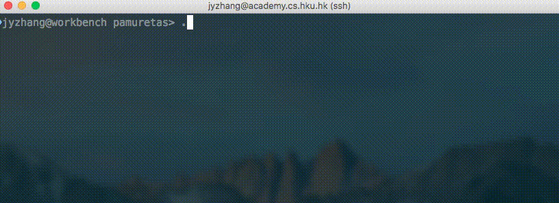
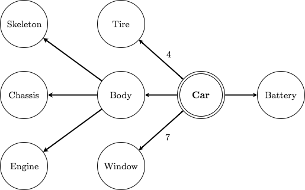
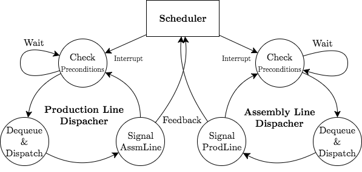
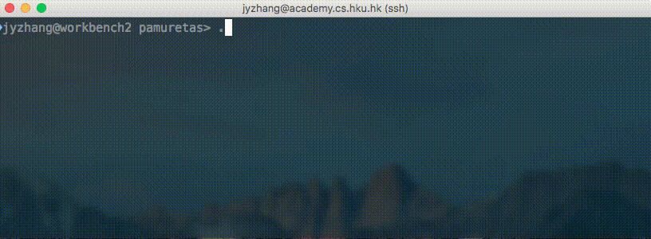
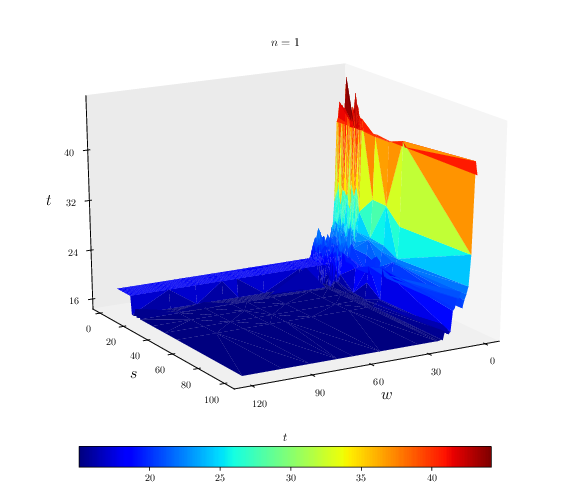

# Pamuretas

**This project has a companion technical report, [learn
more](https://i.cs.hku.hk/~jyzhang/doc/pamuretas/).**

## Introduction

*Pamuretas* (**Pa**rallel **Mu**lti-Dependency **Re**source-Critical **Ta**sk **S**cheduler)
is a dynamic job allocation and dispatcher program that is designed to be
robust, flexible and efficient. Currently, it can only solve one particular
instance of this class of problems, but it does it very well.

### Problem Formulation

We formulate our problem as a variant to the classical custume-producer problem
with Resource Constrained Project Scheduling Problem (RCPSP) flavour.
Concretely, given the number of workers and the goal of production, we wish to
complete production with a pre-specified amount of *storage space* such that
any component listed below occupies one space once produced; the space is
freed when it is fed into another production task as raw material.
We further assume the goal of production (i.e., cars) does not
occupy any spaces upon completion.

with the following production time configurations:

| Task     | Time/sec | Amount |
| :-:      | :-:      | :-:    |
| Skeleton | 5        | 1      |
| Engine   | 4        | 1      |
| Chassis  | 3        | 1      |
| Body     | 4        | 1      |
| Window   | 1        | 7      |
| Tire     | 2        | 4      |
| Battery  | 3        | 1      |
| Car      | 6        | --     |

### Features

It has the following charming features:

- Multi-Threading

    Pamuretas assumes a customized input of number of maximum threads
    that may run concurrently. It leverages the abundant working resource if and when
    possible but contemplate discreetly when facing limited resource to
    guarantee a stable performance.

- Scalability

    Pamuretas is shipped with a dedicated scheduler and two dispatchers, through
    whose delegation and feedback, Pamuretas is able to perform decently well
    no matter what task it is facing. Under most scenarios, the dynamic task
    scheduling results a nearly optimal solution.

- Robustness

    Pamuretas has two built-in systems for deadlock prevention and
    handling/recovery;
    its built-in signaling mechanism enables the feedback between dispatchers
    such that both competition and hungers between threads are minimized.

### Architecture

Pamuretas adapted the master-slave paradigm, and model the sets of individual tasks
as two FIFO queues, where they are enqueued in topological order of the DAG.
Concretely:

The core of Pamuretas lies on its ability of delegating between the key
components:

As we shall see in the sequel, these are vital to Pamuretas' performance and
robustness.

## Usage

### Dependencies

**Important Note for MacOS Users:** the dependency `semaphore` has
deprecated in the `clang` distribution. Please do NOT run it, otherwise
unexpected error may occur.

Pamuretas is written in pure `c`, with `pthread`, `semaphore` and `omp`
libraries linked.

### Installation

First, clone this repo via `git`:

    $ git clone https://github.com/zjiayao/Pamuretas

Then we may build from the source:

    $ cd pamuretas && make

By default, we turn off the `debug` mode, which makes Pamuretas
more verbose while working, to turn it on, add the following
argument when `make`:

    $ make debug=on

This would build an executable `pamuretas`.

### Invoking via CLI

Pamuretas takes three parameters:

    $ ./pamuretas [goals] [spaces] [workers]

where all of them should be positive integers. Pamuretas
does not allow input configuration which are insolvable:

    $ ./pamuretas 1 8 1
    [Fatal] Single worker requires at least 13 space but only 8 given, abort

### Utilities

We also provide a handful of utilities for easy-benchmarking. These
are included in the `benchmarking` and `results` folder, where
a `python` plotter, a `c` test-case enumerate and several `shell`
scripts for prettifying the result. Please refer to the comments therein
for usage.

## Examples

Here we attach a series of screencasts exhibiting
the robustness of Pamuretas under critical scenarios.

### Single Worker, Thirteen Space

This is a very critical scenario, a slight misgiving would
yields trap a less-carefully implemented algorithm.

### Single Space, Huge Working Force

This posts two difficulties: how to optimally use
the only one space; and how to avoid workers from
competiting with each other.

## Benchmarking Results

Pamuretas has been thoroughly tested against over five
thousand configurations. This indeed yields some interesting
benchmarking results.

### Baseline

We first find out the time needed for one production goal
with sufficient resource:

which is about 15 seconds.

### Producing One Single Car

We note Pamuretas is able to utilize the abundant
working force and storage space rather quickly;
it also does not suffer from deadlock and alike
when very limited spaces are provided. The results
are nearly-optimal compared to the baseline computed
from last section.

### Producing Multiple Cars

When we scale up the production task, we note
the contours are nearly identical -- with
one peak appearing at low space region. This
suggested limited space posts more threats to Pamuretas.

Furthermore, at abundant resource region, the running
time of Pamuretas is near optimal and remains stable
(the plateau near the reader).

### Throughput

We proceed to consider the throughput of Pamuretas.

First noted the plotter automatically extrapolates
the values at the boundary, hence resulting the slope
near reader. This should be ignored though.

### Scalability

Under the scenario where sufficient resources are available,
Pamuretas is able to finish the production near the optimal
time, i.e., around 15 seconds.

## Acknowledgment and Disclaimer

Part of this project has been submitted in partial fulfillment
for the course *Operating Systems* offered by HKU, 2017-18.
We thank [Mr. Pengfei Xu](https://github.com/FreemanX) for providing
this motivating example.
